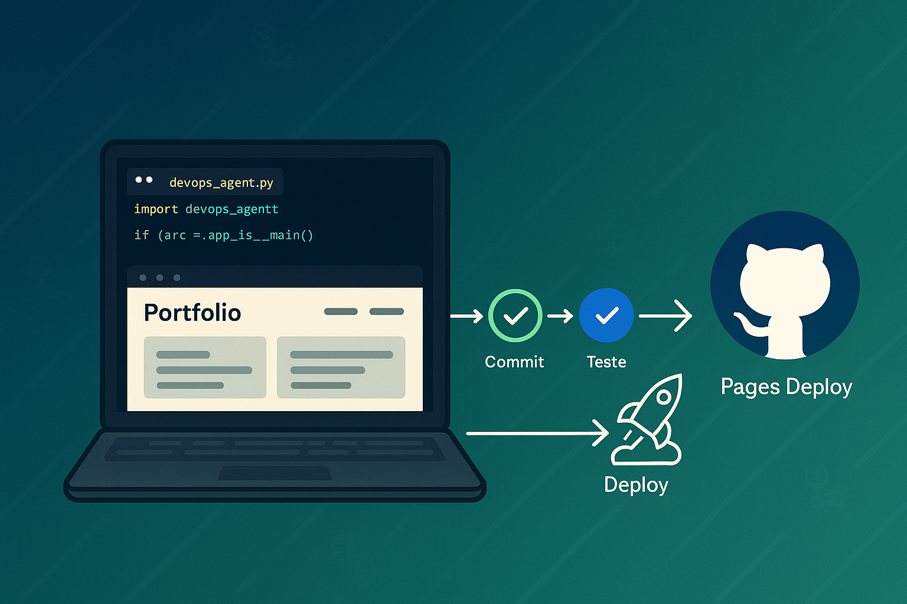
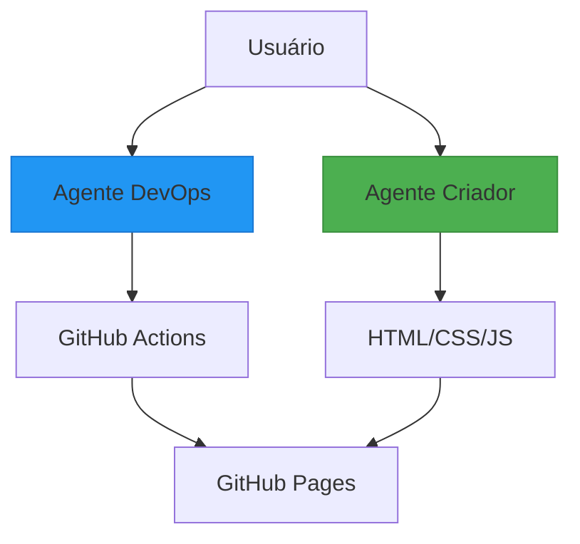
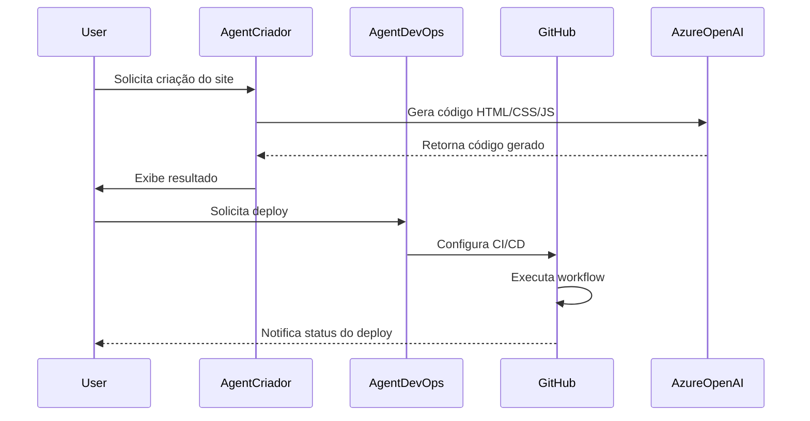

# 🚀 AutoPortfolio: Sistema Automatizado de Portfólio com IA 

[](https://github.com/Jcnok/artigo-site-portifolio/actions)
[](LICENSE)



## 📚 Índice
- [🚀 AutoPortfolio: Sistema Automatizado de Portfólio com IA](#-autoportfolio-sistema-automatizado-de-portfólio-com-ia)
  - [📚 Índice](#-índice)
  - [✨ Sobre o Projeto](#-sobre-o-projeto)
  - [🎯 Funcionalidades](#-funcionalidades)
  - [⚙️ Arquitetura do Sistema](#️-arquitetura-do-sistema)
  - [📂 Estrutura de Arquivos](#-estrutura-de-arquivos)
  - [🔧 Pré-requisitos](#-pré-requisitos)
  - [🛠️ Instalação Passo a Passo](#️-instalação-passo-a-passo)
    - [1. Clone o Repositório](#1-clone-o-repositório)
    - [2. Configure o Ambiente](#2-configure-o-ambiente)
    - [3. Instale Dependências](#3-instale-dependências)
  - [🚦 Como Usar](#-como-usar)
    - [Execução Completa](#execução-completa)
    - [Acesso ao Site](#acesso-ao-site)
  - [🧠 Diagrama do Sistema](#-diagrama-do-sistema)
  - [🤝 Contribuindo](#-contribuindo)
  - [📄 Licença](#-licença)

[⬆ Voltar ao Índice](#-índice)

---

## ✨ Sobre o Projeto


Solução inteligente que combina **IA Generativa** com **DevOps** para criar e implantar automaticamente portfólios profissionais. Desenvolvido para a 27ª Competição de Artigos da DIO, utiliza:

- 🤖 Azure OpenAI para geração de código
- ⚡ LangChain para orquestração de agentes
- 🔄 GitHub Actions para CI/CD automático
- 🎨 GitHub Pages para hospedagem gratuita

[⬆ Voltar ao Índice](#-índice)

---

## 🎯 Funcionalidades
| Recurso               | Descrição                                          | Emoji |
|-----------------------|---------------------------------------------------|-------|
| Geração de Site       | Cria HTML/CSS/JS automaticamente                  | 🎨    |
| Commits Semânticos    | Mensagens seguindo Conventional Commits           | 📝    |
| Deploy Automático     | CI/CD configurado com GitHub Actions              | 🔄    |
| Design Responsivo     | Layout que se adapta a qualquer dispositivo       | 📱    |
| Segurança             | Credenciais armazenadas em variáveis de ambiente  | 🔒    |

[⬆ Voltar ao Índice](#-índice)

---

## ⚙️ Arquitetura do Sistema




[⬆ Voltar ao Índice](#-índice)

---

## 📂 Estrutura de Arquivos
```
artigo-site-portifolio/
├── .github/
│ └── workflows/
│   └── deploy.yml # Configuração do CI/CD
├── src/
│ ├── main.py # Script principal
│ ├── devops_agent.py # Agente de DevOps
│ └── site_creator_agent.py# Agente de Criação
├── site/
│ ├── index.html # Página principal
│ ├── css/
│ │ └── style.css # Estilos
│ └── js/
│   └── main.js # Interatividade
├── img/ # Imagens e GIFs
├── .env # Credenciais
└── README.md # Este arquivo
```

[⬆ Voltar ao Índice](#-índice)

---

## 🔧 Pré-requisitos
- ✅ Conta no [Azure](https://azure.microsoft.com)
- ✅ Conta no [GitHub](https://github.com)
- ✅ [Python 3.10+](https://python.org)
- ✅ [Git](https://git-scm.com)

**Verifique as instalações:**
```bash
python --version

git --version
```

[⬆ Voltar ao Índice](#-índice)

---

## 🛠️ Instalação Passo a Passo

### 1. Clone o Repositório

```bash
git clone https://github.com/Jcnok/artigo-site-portifolio.git
cd artigo-site-portifolio
```


### 2. Configure o Ambiente

```bash
cp .env.example .env
```
**Edite com suas credenciais**

```bash
nano .env # Ou abra no editor preferido
```


### 3. Instale Dependências
```bash
pip install -r requirements.txt
```
```bash
python -m venv .venv
```
```bash
source .venv/bin/activate # Linux/Mac

.venv\Scripts\activate # Windows
```


[⬆ Voltar ao Índice](#-índice)

---

## 🚦 Como Usar

### Execução Completa
```bash
python src/main.py
```

### Acesso ao Site
Após o deploy automático, acesse:
```bash
https://[SEU_USUARIO].github.io/[SEU_REPOSITORIO]
```


[⬆ Voltar ao Índice](#-índice)

---

## 🧠 Diagrama do Sistema


[⬆ Voltar ao Índice](#-índice)

---

## 🤝 Contribuindo
1. **Faça Fork** do projeto
2. Crie uma branch:  
   `git checkout -b feature/nova-feature`
3. Commit suas mudanças:  
   `git commit -m "feat: minha nova feature incrível"`
4. Push para a branch:  
   `git push origin feature/nova-feature`
5. Abra um **Pull Request**

[⬆ Voltar ao Índice](#-índice)

---

## 📄 Licença
Distribuído sob licença MIT. Veja [LICENSE](LICENSE) para detalhes.

[⬆ Voltar ao Índice](#-índice)

---

**Desenvolvido com ❤️ por [Jcnok](https://github.com/Jcnok)**  
*27ª Competição de Artigos da DIO*


