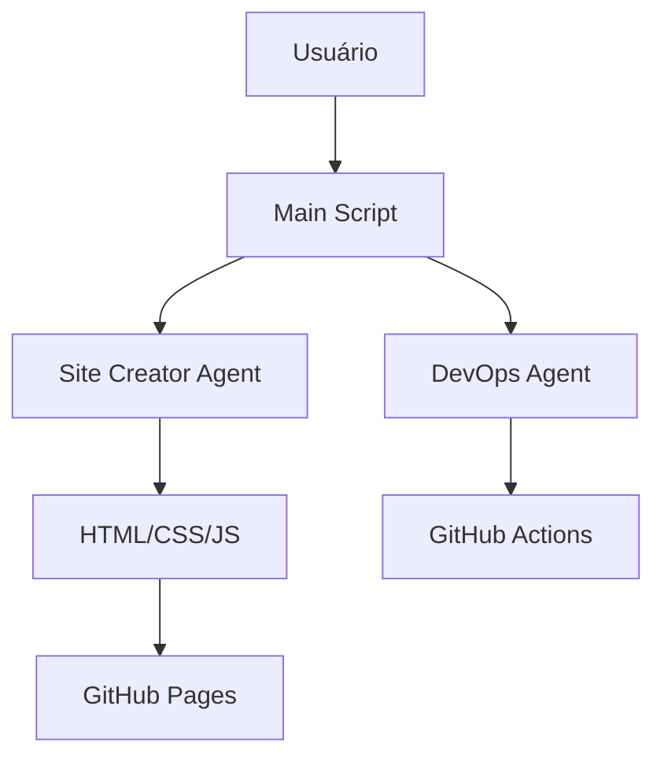
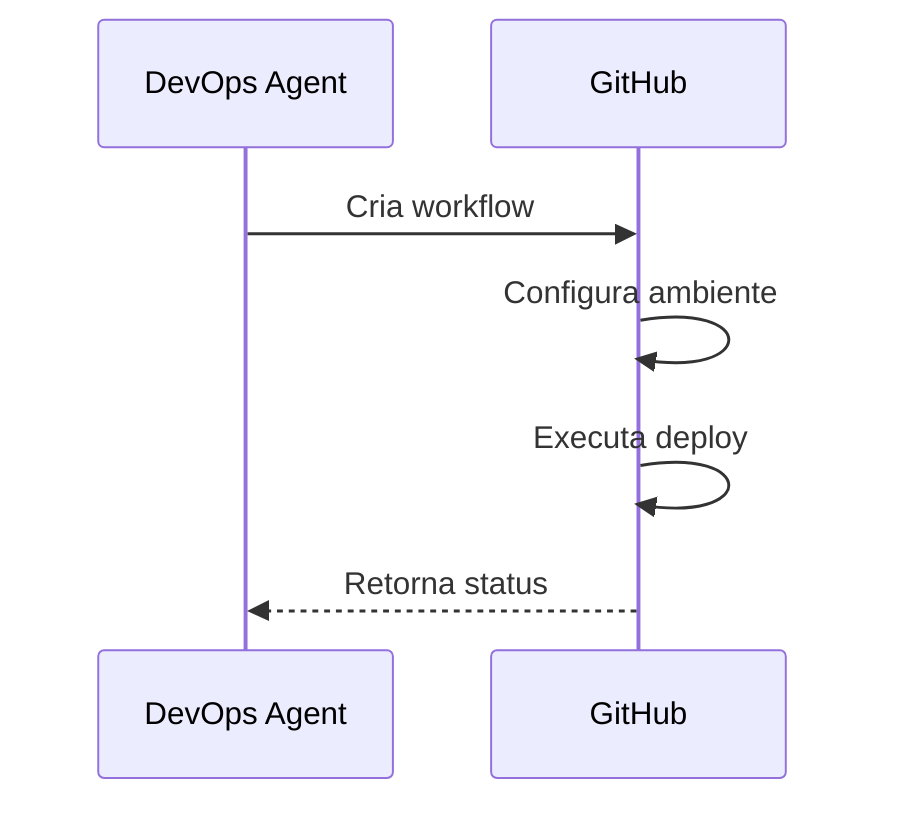

# 📚 Documentação Técnica do AutoPortfolio

## 🌐 Visão Geral do Projeto
Sistema automatizado para criação e deploy de portfólio profissional usando agentes de IA.  
**Versão Atual:** 1.2.0  
**Última Atualização:** Junho 2024  

### Arquitetura Principal


[⬆ Voltar ao Sumário](#-sumário)

---

## 🛠 Configuração do Ambiente

### Requisitos Mínimos
| Componente      | Versão  | Instalação                      |
|-----------------|---------|---------------------------------|
| Python          | 3.10+   | [python.org](https://python.org)|
| Git             | 2.30+   | [git-scm.com](https://git-scm.com)|
| Azure OpenAI    | -       | [portal.azure.com](https://portal.azure.com)|

### Passo a Passo Inicial
```
# Clone o repositório

git clone https://github.com/Jcnok/artigo-site-portifolio.git
cd artigo-site-portifolio

# Configure ambiente virtual

python -m venv .venv
source .venv/bin/activate  \# Linux/Mac

# .venv\Scripts\activate  \# Windows

# Instale dependências

pip install -r requirements.txt

```

### Variáveis de Ambiente (`.env`)
```
# Azure OpenAI

AZURE_OPENAI_ENDPOINT = "https://<seu-endpoint>.openai.azure.com/"
AZURE_OPENAI_API_KEY = "<sua-chave>"
DEPLOYMENT_NAME = "gpt-4o-mini"

# GitHub

GITHUB_USERNAME = "<seu-usuario>"
GITHUB_EMAIL = "<seu-email>"
GITHUB_TOKEN = "<seu-token>"
GITHUB_REPO = "<nome-repositorio>"

```

**Onde obter as credenciais:**
- Azure: [Criar recurso OpenAI](https://portal.azure.com/#create/Microsoft.CognitiveServicesOpenAI)
- GitHub: [Gerar Token](https://github.com/settings/tokens) (scope: `repo`)

[⬆ Voltar ao Sumário](#-sumário)

---

## 🤖 Sistema de Agentes

### Site Creator Agent
**Responsabilidade:** Geração do conteúdo estático  
**Arquivo:** `src/site_creator_agent.py`

#### Ferramentas Principais
| Tool          | Descrição                          | Exemplo de Saída |
|---------------|-----------------------------------|------------------|
| CreateHTML    | Gera HTML semântico               | `index.html`     |
| CreateCSS     | Cria estilos modernos             | `style.css`      |
| CreateJS      | Adiciona interatividade           | `main.js`        |

**Fluxo de Geração:**
```
# Exemplo de chamada do agent

agent.run("Crie seção de projetos com cards interativos")

```

### DevOps Agent
**Responsabilidade:** Automação do fluxo DevOps  
**Arquivo:** `src/devops_agent.py`

#### Workflow do CI/CD


[⬆ Voltar ao Sumário](#-sumário)

---

## 🎨 Customização do Portfólio

### 1. Modificando Estilos
Edite `site/css/style.css`:
```
:root {
--primary-color: \#2A2A2A; /* Cor principal */
--font-family: 'Roboto', sans-serif; /* Fonte */
}

/* Exemplo: Alterar cabeçalho */
header {
background: linear-gradient(45deg, var(--primary-color), \#1A1A1A);
}

```

### 2. Atualizando Conteúdo
Modifique o prompt em `src/main.py`:
```
site_creator.run(
"Crie seção 'Projetos' com:"
"- 3 cards com imagens"
"- Links para repositórios GitHub"
"- Tags de tecnologias"
)

```

### 3. Adicionando Novas Funcionalidades
1. Crie nova tool em `site_creator_agent.py`
```
class CreateContactFormTool(BaseTool):
name: str = "create_contact_form"
description: str = "Cria formulário de contato"

    def _run(self, content: str) -> str:
       # Implementação do formulário
```

2. Atualize o agent:
```
def _setup_tools(self):
return [..., CreateContactFormTool()]

```

[⬆ Voltar ao Sumário](#-sumário)

---

## ⚙️ Fluxo de Deploy Avançado

### Estrutura do Workflow (`.github/workflows/deploy.yml`)
```
name: Deploy to GitHub Pages
on:
push:
branches: [main]
paths: ['site/**']
jobs:
deploy:
runs-on: ubuntu-latest
steps:
- name: Checkout
uses: actions/checkout@v4
- name: Deploy
uses: JamesIves/github-pages-deploy-action@v4
with:
folder: 'site'

```

### Monitoramento e Debug
```
# Verificar logs locais

act -j deploy -v

# Forçar novo deploy

git commit --allow-empty -m "Trigger deployment"
git push origin main

```

[⬆ Voltar ao Sumário](#-sumário)

---

## 🐛 Solução de Problemas Comuns

### Erro: "Repository not found"
**Sintoma:** Falha ao fazer push  
**Solução:**
```
# Verificar URL remota

git remote -v

# Reconfigurar remote

git remote set-url origin https://<USER>:<TOKEN>@github.com/<USER>/<REPO>.git

```

### CSS não Carregando
1. Verificar caminhos no HTML:
```
<!-- Correto -->

<link href="css/style.css" rel="stylesheet">
<!-- Incorreto -->

<link href="styles.css" rel="stylesheet">
```
2. Limpar cache do GitHub Pages:
```
https://github.com/<USER>/<REPO>/settings/pages\#enviar-cache

```

[⬆ Voltar ao Sumário](#-sumário)

---

## 🤝 Guia de Contribuição

### Convenções de Código
- Commits Semânticos: `feat:`, `fix:`, `docs:`, etc.
- PEP8 para Python
- Documentação obrigatória para novas features

### Processo de PR
1. Crie uma branch descritiva:
```
git checkout -b feat/nova-secao-projetos

```

2. Adicione testes relevantes:
```
# tests/test_agents.py

def test_site_creation():
assert os.path.exists('site/index.html')

```

3. Submeta o Pull Request com:
- Descrição detalhada
- Screenshots (se aplicável)
- Referências a issues relacionadas

[⬆ Voltar ao Sumário](#-sumário)

---

## 📄 Licença e Contato

**Licença:** MIT ([Ver Completa](LICENSE))  
**Contato Técnico:** [jcnok@example.com](mailto:jcnok@example.com)  
**Documentação Oficial:** [docs.autoportfolio.ai](https://docs.autoportfolio.ai)  

```
MIT License
Copyright (c) 2024 Jcnok

```

[⬆ Voltar ao Sumário](#-sumário)

---

## 🔮 Roadmap Futuro
- [ ] Integração com CMS Headless
- [ ] Dashboard de Analytics
- [ ] Sistema de Templates
- [ ] Internacionalização (i18n)

**Sugestões?** Abra uma [issue](https://github.com/Jcnok/artigo-site-portifolio/issues)!


---

## 📌 Notas Finais

1. Mantenha sempre o `.env` fora do versionamento
2. Revise periodicamente as permissões do GitHub Token
3. Monitore o uso da API da OpenAI pelo [Azure Portal](https://portal.azure.com)

**Equipe de Desenvolvimento:**

- **Líder Técnico:** Jcnok
- **Arquitetura de IA:** @azure-openai
- **DevOps:** @github-actions
