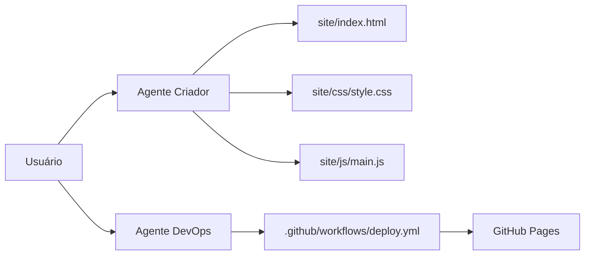

# 🚀 AutoPortfolio: Sistema Automatizado de Portfólio com IA 

[](https://github.com/Jcnok/artigo-site-portifolio/actions)
[](LICENSE)


## 📚 Índice
- [🚀 AutoPortfolio: Sistema Automatizado de Portfólio com IA](#-autoportfolio-sistema-automatizado-de-portfólio-com-ia)
  - [📚 Índice](#-índice)
  - [✨ Sobre o Projeto](#-sobre-o-projeto)
  - [🎯 Funcionalidades](#-funcionalidades)
  - [⚙️ Arquitetura Técnica](#️-arquitetura-técnica)
  - [🔑 Configuração de Chaves](#-configuração-de-chaves)
    - [Arquivo .env](#arquivo-env)
  - [🛠️ Instalação Detalhada](#️-instalação-detalhada)
    - [1. Pré-requisitos Essenciais](#1-pré-requisitos-essenciais)
    - [2. Clone e Configuração](#2-clone-e-configuração)
  - [⚡ Configuração do GitHub](#-configuração-do-github)
    - [Passo 1: Permissões do Workflow](#passo-1-permissões-do-workflow)
    - [Passo 2: Configuração do GitHub Pages](#passo-2-configuração-do-github-pages)
  - [🚀 Fluxo de Deploy](#-fluxo-de-deploy)
    - [Etapas Automatizadas](#etapas-automatizadas)
    - [Monitoramento](#monitoramento)
  - [🔧 Solução de Problemas Comuns](#-solução-de-problemas-comuns)
    - [Erro 403 ao Fazer Push](#erro-403-ao-fazer-push)
    - [Site Não Atualizado](#site-não-atualizado)
  - [🧠 Considerações sobre IA](#-considerações-sobre-ia)
    - [Contexto Educacional](#contexto-educacional)
  - [📄 Licença](#-licença)
  - [📌 Passos Finais para Implementação](#-passos-finais-para-implementação)

[⬆ Voltar ao Índice](#-índice)

---

## ✨ Sobre o Projeto


Solução completa para automação de portfólios profissionais, desenvolvida como estudo de caso para a **27ª Competição de Artigos da DIO**. Combina:

- 🤖 **Azure OpenAI**: Geração inteligente de código
- ⚡ **LangChain**: Coordenação de agentes especializados
- 🔄 **GitHub Actions**: Pipeline CI/CD automatizado
- 🛡️ **Security by Design**: Proteção de credenciais

> **Nota de Implementação:** Este projeto é uma prova de conceito educacional. Em ambientes de produção, considere adicionar mecanismos de segurança adicionais.

[⬆ Voltar ao Índice](#-índice)

---

## 🎯 Funcionalidades
| Recurso               | Detalhes Técnicos                                  | Tecnologias |
|-----------------------|---------------------------------------------------|-------------|
| Geração de Site       | HTML5 semântico + CSS3 moderno + ES6              | Azure OpenAI|
| Versionamento         | Commits semânticos automáticos                    | GitPython   |
| Deploy Contínuo       | CI/CD com gatilho em push para main               | GitHub Actions |
| Monitoramento         | Logs detalhados de execução                       | Python      |
| Segurança             | Variáveis de ambiente criptografadas              | dotenv      |

[⬆ Voltar ao Índice](#-índice)

---

## ⚙️ Arquitetura Técnica


[⬆ Voltar ao Índice](#-índice)

---

## 🔑 Configuração de Chaves

### Arquivo .env
Crie um arquivo `.env` na raiz do projeto com:

```


# Azure OpenAI (obtenha em https://portal.azure.com/\#view/Microsoft_Azure_ProjectOxford/CognitiveServicesHub/~/OpenAI)

AZURE_OPENAI_ENDPOINT = "https://exemplo.openai.azure.com/"
AZURE_OPENAI_API_KEY = "sua-chave-aqui"
DEPLOYMENT_NAME = "gpt-4o-mini"

# GitHub (crie token em https://github.com/settings/tokens)

GITHUB_USERNAME = "seu-usuario"
GITHUB_EMAIL = "seu-email@provedor.com"
GITHUB_TOKEN = "ghp_suaChaveSecreta"
GITHUB_REPO = "nome-do-repositorio"

```

[⬆ Voltar ao Índice](#-índice)

---

## 🛠️ Instalação Detalhada

### 1. Pré-requisitos Essenciais
- Python 3.10+ ([Download](https://www.python.org/downloads/))
- Git ([Install Guide](https://git-scm.com/book/en/v2/Getting-Started-Installing-Git))
- Conta no Azure com acesso à OpenAI ([Signup](https://azure.microsoft.com/free/))

### 2. Clone e Configuração
```
git clone https://github.com/Jcnok/artigo-site-portifolio.git
cd artigo-site-portifolio
python -m venv .venv
source .venv/bin/activate  \# Linux/Mac

# .venv\Scripts\activate  \# Windows

pip install -r requirements.txt

```

[⬆ Voltar ao Índice](#-índice)

---

## ⚡ Configuração do GitHub

### Passo 1: Permissões do Workflow
1. Acesse: `https://github.com/seu usuario/artigo-site-portifolio/settings/actions`
2. Em **Workflow Permissions**:
   - Selecione ✅ Read and write permissions
   - Clique em **Save**


### Passo 2: Configuração do GitHub Pages
1. Acesse: `https://github.com/seu usuario/artigo-site-portifolio/settings/pages`
2. Em **Branch**:
   - Selecione `gh-pages`
   - Pasta `/ (root)`
3. Clique em **Save**


[⬆ Voltar ao Índice](#-índice)

---

## 🚀 Fluxo de Deploy

### Etapas Automatizadas
1. Push para `main` → Dispara workflow
2. GitHub Actions:
   - Faz checkout do código
   - Configura ambiente
   - Deploy para `gh-pages`
3. Site disponível em:
4. https://Jcnok.github.io/artigo-site-portifolio


### Monitoramento
Acesse a aba **Actions** para ver logs detalhados:


[⬆ Voltar ao Índice](#-índice)

---

## 🔧 Solução de Problemas Comuns

### Erro 403 ao Fazer Push
**Sintoma:**
```
remote: Permission to user/repo.git denied to github-actions[bot]

```

**Solução:**
1. Verifique se o token GITHUB_TOKEN tem permissão `repo`
2. Renove o token em [GitHub Tokens](https://github.com/settings/tokens)
3. Atualize o arquivo `.env`

### Site Não Atualizado
1. Verifique se o workflow foi executado
2. Confira o branch `gh-pages` no repositório
3. Limpe cache do navegador com `Ctrl+F5`

[⬆ Voltar ao Índice](#-índice)

---

## 🧠 Considerações sobre IA

### Contexto Educacional
Este projeto demonstra o potencial dos **agentes de IA** para automação de tarefas repetitivas, porém:

**Melhorias para Produção:**
- Adicionar validação de código gerado
- Implementar testes unitários automatizados
- Adicionar monitoramento de custos da OpenAI
- Criar sistema de rollback automático

**Limitações Atuais:**
- Dependência de conexão com APIs externas
- Necessidade de supervisão humana para conteúdo sensível
- Gerenciamento manual de versões do workflow

> **Aviso Legal:** Em ambientes profissionais, sempre revise o código gerado por IA antes do deploy.

[⬆ Voltar ao Índice](#-índice)

---

## 📄 Licença
Distribuído sob licença MIT. Veja [LICENSE](LICENSE) para detalhes.

```
MIT License
Copyright (c) 2024 Jcnok

```

[⬆ Voltar ao Índice](#-índice)

---

**Desenvolvido com ❤️ por [Jcnok](https://github.com/Jcnok)**  
*27ª Competição de Artigos da DIO - "Python com IA"*

> 💡 Este projeto é um exemplo educacional. Em cenários reais, considere:
> - Auditoria de segurança do código gerado
> - Limitação de permissões dos agentes
> - Monitoramento contínuo de desempenho

---

## 📌 Passos Finais para Implementação

1. Crie a pasta `img` com:
    - `cover.png`: Imagem de capa (1200x630px)
    - `demo.gif`: Gravação da execução
    - `github-permissions.png`: Print da configuração
    - `github-pages.png`: Print do settings
    - `actions-logs.png`: Exemplo de log
2. Personalize os links:
    - Substitua `Jcnok` pelo seu usuário GitHub
    - Atualize URLs de imagens
3. Teste o fluxo completo:

```bash
python src/main.py
git add .
git commit -m "feat: initial commit"
git push origin main
```